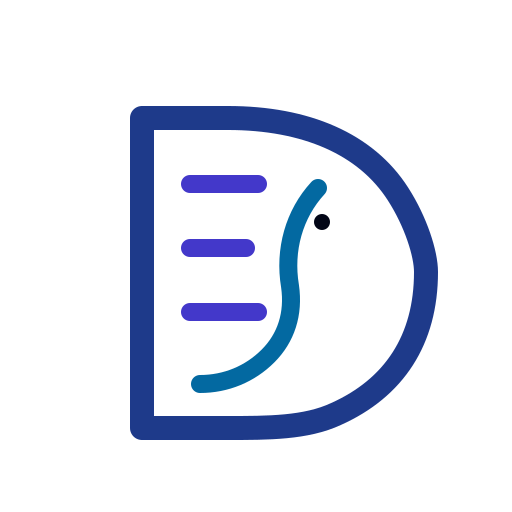

  

  

  
  
  
  

---

<h1 align="left">
  
  Dancing Elephant Labs
</h1>

**Dancing Elephant Labs** builds modern software for organizations that need more than generic agency delivery. We combine product thinking, hands-on engineering, and deep domain understanding to ship systems that are secure, practical, and ready to grow.

We’re especially strong where software needs to map cleanly to real operational complexity, including **SSI-focused systems**, **verifiable credentials**, and **crypto-native platforms**.

---

## What we’re built around

<table>
  <tr>
    <td width="50%" valign="top">
      <h3>Specialized When It Counts</h3>
      
We go deep in domains where generic delivery falls apart, with our domain expertise.

    </td>
    <td width="50%" valign="top">
      <h3>Demo-Led Conversations</h3>
      
We prefer working prototypes and concrete product thinking over abstract claims.

    </td>
  </tr>
</table>

---

## Domains we work in

  
  
  
  

---

<!-- ## Tech stack

  
  
  
  
  
  
  

 -->

---

## Build philosophy

Build software people can actually use —
not just admire in screenshots.

Whether you need:

- a domain-specific platform
- an internal operations tool
- an SSI-focused product
- a secure crypto-native experience

we’d love to talk through the right next step.

  

---